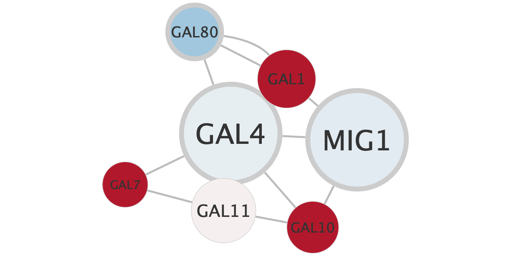
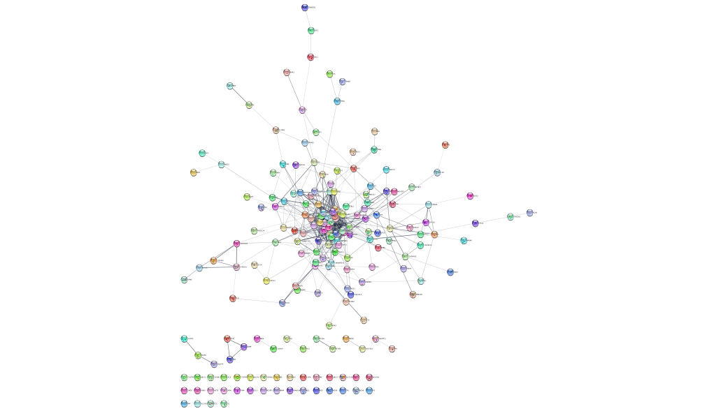
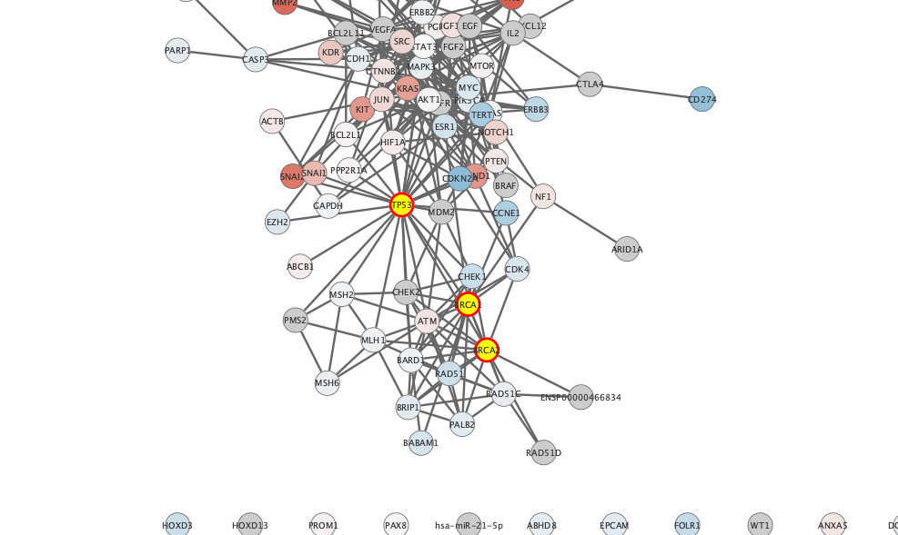

```{r setup, include=FALSE}
knitr::opts_chunk$set(echo = TRUE)
```






```{r}
library("RCy3")
```

```{r}
cytoscapePing()
cytoscapeVersionInfo()
```

```{r}
nodes <- data.frame(id=c("node 0","node 1","node 2","node 3"),
           group=c("A","A","B","B"),
           score=as.integer(c(20,10,15,5)),
           stringsAsFactors=FALSE)
edges <- data.frame(source=c("node 0","node 0","node 0","node 2"),
           target=c("node 1","node 2","node 3","node 3"),
           interaction=c("inhibits","interacts","activates","interacts"),  
           weight=c(5.1,3.0,5.2,9.9), 
           stringsAsFactors=FALSE)

createNetworkFromDataFrames(nodes,edges, title="my first network", collection="DataFrame Example")
```

```{r}
setVisualStyle('Marquee')
```

```{r}
style.name = "myStyle"
defaults <- list(NODE_SHAPE="diamond",
                 NODE_SIZE=30,
                 EDGE_TRANSPARENCY=120,
                 NODE_LABEL_POSITION="W,E,c,0.00,0.00")
nodeLabels <- mapVisualProperty('node label','id','p')
nodeFills <- mapVisualProperty('node fill color','group','d',c("A","B"), c("#FF9900","#66AAAA"))
arrowShapes <- mapVisualProperty('Edge Target Arrow Shape','interaction','d',c("activates","inhibits","interacts"),c("Arrow","T","None"))
edgeWidth <- mapVisualProperty('edge width','weight','p')

createVisualStyle(style.name, defaults, list(nodeLabels,nodeFills,arrowShapes,edgeWidth))
setVisualStyle(style.name)
```

```{r}
    g = new ('graphNEL', edgemode='directed')
    g = graph::addNode ('A', g)
    g = graph::addNode ('D', g)
    g = graph::addNode ('C', g, edges = list('D'))
    g = graph::addNode ('B', g, edges = list(c('A','D','C')))
    createNetworkFromGraph (g, title='simple network', collection='GraphNEL Example')
```

```{r}
df <- data.frame (moleculeType=c('kinase','TF','cytokine','cytokine'),
                  log2fc=c(1.8,3.0,-1.2,-2.5),
                  row.names = c('A','B','C','D'), 
                  stringsAsFactors = FALSE)       
loadTableData (df)
```

```{r}
setNodeShapeDefault ('OCTAGON')
setNodeColorDefault ('#AAFF88')
setNodeSizeDefault  (60)
setNodeFontSizeDefault (30)
```

```{r}
getNodeShapes ()
column <- 'moleculeType'
values <- c ('kinase',  'TF','cytokine')
shapes <- c ('DIAMOND', 'TRIANGLE', 'RECTANGLE')
setNodeShapeMapping (column, values, shapes)
```

```{r}
column <- 'log2fc'
control.points <- c (-3.0, 0.0, 3.0)
colors <-  c ('#5588DD', '#FFFFFF', '#DD8855')  
setNodeColorMapping (column, control.points, colors)
```

```{r}
control.points <- c (-2.0, 0.0, 2.0)
colors <-  c ('#2255CC', '#5588DD', '#FFFFFF', '#DD8855','#CC5522')
setNodeColorMapping (column, control.points, colors)
```

```{r}
control.points = c (-3.0, 2.0, 3.0)
sizes     = c (20, 80, 90)
setNodeSizeMapping (column, control.points, sizes)
```

```{r}
selectNodes ('C','name')
```

```{r}
getSelectedNodes ()
```

```{r}
clearSelection()
?clearSelection
```

```{r}
saveSession('RCy3_vignette_session')
```

```{r}
full.path=paste(getwd(),'RYc3_vignette_image',sep='/')
exportImage(full.path, 'PNG', zoom=200)
```


