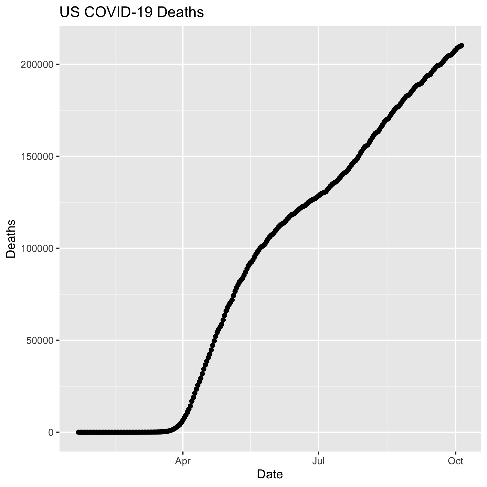
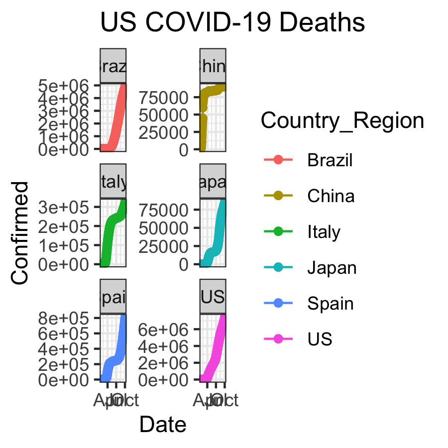

```{r setup, include=FALSE}
knitr::opts_chunk$set(echo = TRUE)
```

```{r}
library(tidyverse)
library(dplyr)
library(lubridate)
library(DT)
library(plotly)
library(gganimate)
library(transformr)
```

```{r}
tsConfirmedLongGlobal <- read_csv(url("https://raw.githubusercontent.com/CSSEGISandData/COVID-19/master/csse_covid_19_data/csse_covid_19_time_series/time_series_covid19_confirmed_global.csv")) %>%
  rename(Province_State = "Province/State", Country_Region = "Country/Region")  %>% 
               pivot_longer(-c(Province_State, Country_Region, Lat, Long),
                             names_to = "Date", values_to = "Confirmed") 
tsDeathsLongGlobal <- read_csv(url("https://raw.githubusercontent.com/CSSEGISandData/COVID-19/master/csse_covid_19_data/csse_covid_19_time_series/time_series_covid19_deaths_global.csv")) %>%
  rename(Province_State = "Province/State", Country_Region = "Country/Region")  %>% 
  pivot_longer(-c(Province_State, Country_Region, Lat, Long),
               names_to = "Date", values_to = "Deaths")
```

```{r}
tsConfirmedLongGlobal <- tsConfirmedLongGlobal %>% 
  unite(Key, Province_State, Country_Region, Date, sep = ".", remove = FALSE)

tsDeathsLongGlobal <- tsDeathsLongGlobal %>% 
  unite(Key, Province_State, Country_Region, Date, sep = ".") %>% 
  select(Key, Deaths)

tsJoinedGlobal <- full_join(tsConfirmedLongGlobal, tsDeathsLongGlobal, by = c("Key")) %>% 
    select(-Key)

tsJoinedGlobal$Date <- mdy(tsJoinedGlobal$Date)

tsJoinedGlobalCounts <- tsJoinedGlobal %>% 
  pivot_longer(-c(Province_State, Country_Region, Lat, Long, Date),
               names_to = "Report_Type", values_to = "Counts")
```

```{r}
pdf("exported_images/time_series_example_plot.pdf", width=6, height=3)
tsJoinedGlobal %>% 
  group_by(Country_Region,Date) %>% 
  summarise_at(c("Confirmed", "Deaths"), sum) %>% 
  filter (Country_Region == "US") %>% 
    ggplot(aes(x = Date,  y = Deaths)) + 
    geom_point() +
    geom_line() +
    ggtitle("US COVID-19 Deaths")
dev.off()
```

```{r}
ppi <- 300
png("exported_images/time_series_example_plot.png", width=6*ppi, height=6*ppi, res=ppi)
tsJoinedGlobal %>% 
  group_by(Country_Region,Date) %>% 
  summarise_at(c("Confirmed", "Deaths"), sum) %>% 
  filter (Country_Region == "US") %>% 
    ggplot(aes(x = Date,  y = Deaths)) + 
    geom_point() +
    geom_line() +
    ggtitle("US COVID-19 Deaths")
dev.off()
```




```{r}
ggplotly(
  tsJoinedGlobal %>% 
    group_by(Country_Region,Date) %>% 
    summarise_at(c("Confirmed", "Deaths"), sum) %>% 
    filter (Country_Region == "US") %>% 
    ggplot(aes(x = Date,  y = Deaths)) + 
      geom_point() +
      geom_line() +
      ggtitle("US COVID-19 Deaths")
 )
```

```{r}
US_deaths <- tsJoinedGlobal %>% 
    group_by(Country_Region,Date) %>% 
    summarise_at(c("Confirmed", "Deaths"), sum) %>% 
    filter (Country_Region == "US")
 p <- ggplot(data = US_deaths, aes(x = Date,  y = Deaths)) + 
        geom_point() +
        geom_line() +
        ggtitle("US COVID-19 Deaths")
ggplotly(p)
```

```{r}
theme_set(theme_bw())
```

```{r}
data_time <- tsJoinedGlobal %>% 
    group_by(Country_Region,Date) %>% 
    summarise_at(c("Confirmed", "Deaths"), sum) %>% 
    filter (Country_Region %in% c("China","Korea, South","Japan","Italy","US")) 
p <- ggplot(data_time, aes(x = Date,  y = Confirmed, color = Country_Region)) + 
      geom_point() +
      geom_line() +
      ggtitle("Confirmed COVID-19 Cases") +
      geom_point(aes(group = seq_along(Date))) +
      transition_reveal(Date) 
# animate(p,renderer = gifski_renderer(), end_pause = 15)
animate(p, end_pause = 15)
```

#Challenge 1
```{r}
png("exported_images/time_series_Global_growth.png", width=3*ppi, height=3*ppi, res=ppi)
tsJoinedGlobal %>%
  group_by(Country_Region, Date) %>% 
  filter(Country_Region %in% c("US", "China", "Italy", "Brazil", "Japan", "Spain")) %>%
  summarise_at(c("Confirmed", "Deaths"), sum) %>% 
    ggplot(aes(x = Date,  y = Confirmed, color =  Country_Region)) + 
    geom_point() +
    geom_line() +
    ggtitle("US COVID-19 Deaths") +
    facet_wrap(~Country_Region, ncol=2, scales="free_y")

dev.off()
```




#Challenge 2
```{r}
temp <- tsJoinedGlobal %>% 
  group_by(Country_Region,Date) %>% 
  summarise_at(c("Confirmed", "Deaths"), sum) %>% 
  filter (Country_Region %in% c("China","Japan", "Korea, South", "Italy","Spain", "US")) %>% 
    ggplot(aes(x = Date,  y = Deaths)) + 
    geom_point() +
    geom_line() +
    ggtitle("COVID-19 Deaths") +
    facet_wrap(~Country_Region, ncol=2, scales="free_y")

ggplotly(temp)
```

#Challenge 3
```{r}
tsConfirmedLongUS <- read_csv(url("https://raw.githubusercontent.com/CSSEGISandData/COVID-19/master/csse_covid_19_data/csse_covid_19_time_series/time_series_covid19_confirmed_US.csv")) %>%
  select(-c("UID", "iso2", "iso3", "code3",  "FIPS", "Admin2")) %>%
  pivot_longer(-c("Country_Region", "Lat", "Long_", "Combined_Key", "Province_State"), names_to = "Date", values_to = "Confirmed") %>%
  filter(Province_State != "Recovered")
```

```{r}
topStates <- tsConfirmedLongUS %>%
  group_by(Province_State) %>%
  summarise(Confirmed = sum(Confirmed)) %>%
  arrange(desc(Confirmed)) %>%
  slice(1:10)

topStates
```

```{r}
tsConfirmedLongUS$Date <- mdy(tsConfirmedLongUS$Date)
```

```{r}
mostCasesUS <- tsConfirmedLongUS %>%
  filter(Province_State %in% topStates$Province_State) %>%
  group_by(Date, Province_State) %>%
  summarise_at("Confirmed", sum) %>% 
  ggplot(aes(x = Date, y = Confirmed, color = Province_State)) +
  geom_point() +
  geom_line() +
  ggtitle("10 States with Highest Confirmed Rates") +
  geom_point(aes(group = seq_along(Date))) +
  transition_reveal(Date) 

animate(mostCasesUS, end_pause = 10)
```

Application written in R [@RCoreTeam] using the Shiny framework [@Chang2015].

# REFERENCES


